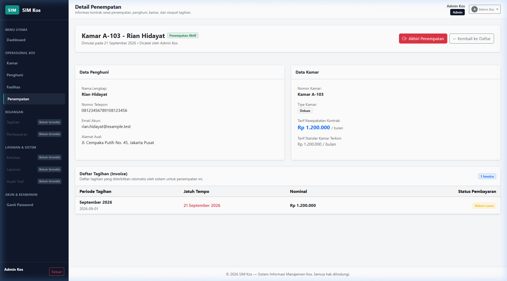
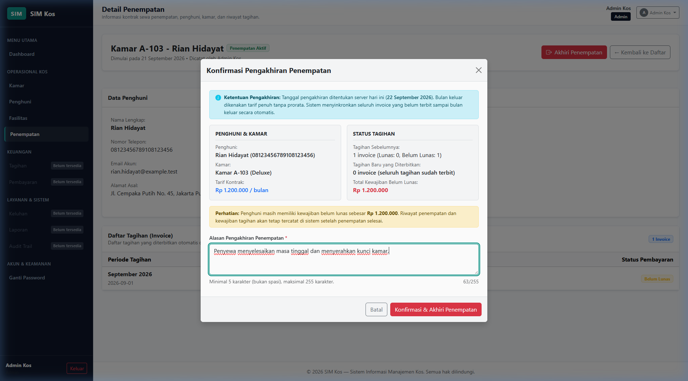
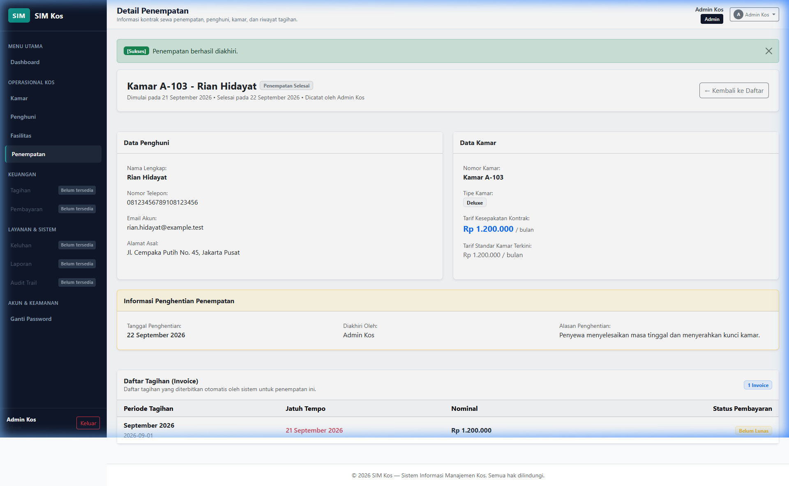
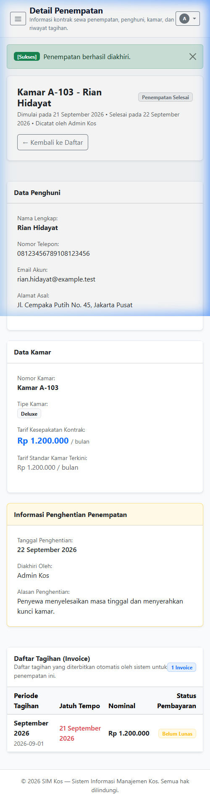

# Walkthrough T11: Akhiri Penempatan (Check-out / Placement Termination)

Dokumen ini mendokumentasikan implementasi teknis, pengujian komprehensif, dan verifikasi antarmuka visual untuk **Task T11: Akhiri Penempatan (Check-out)** pada Sistem Informasi Manajemen (SIM) Kos. Modul ini memungkinkan Administrator mengakhiri penempatan aktif, menyinkronkan seluruh invoice sampai bulan keluar penuh tanpa prorata melalui `BillingService::syncPlacementInvoices`, mencatat tanggal, pelaku, dan alasan selesai secara atomik, membebaskan kamar secara otomatis melalui status hunian turunan (*derived vacancy*), mempertahankan seluruh riwayat penempatan dan kewajiban belum lunas, serta mencatat audit trail ganda (`placements` dan `invoices`).

---

## 1. Ringkasan Perubahan Kode & Arsitektur

### A. Kebijakan Otorisasi: `app/Policies/PlacementPolicy.php`
- Menambahkan method `end(User $user, Placement $placement): bool`:
  - Mengevaluasi kewenangan Administrator aktif (`$user->role?->code === 'admin' && (bool) $user->is_active`).
  - Pemilik (*Owner*) dan Penghuni (*Resident*) dilarang keras mengakses (**HTTP 403 Forbidden**).
  - **Pemisahan Status Bisnis dari Otorisasi**: Status apakah penempatan sudah selesai ditangani oleh service layer sebagai penolakan bisnis yang ramah dan informatif (*clear domain message*), bukan penolakan izin HTTP 403 bagi Administrator yang sah.

---

### B. Service Layer: `app/Services/PlacementService.php`
Menjadi pintu masuk tunggal mutasi pengakhiran penempatan dengan menerapkan penguncian baris pesimistik, snapshot finansial deterministik, dan integritas transaksional atomik:

1. **Pemisahan Pengambilan Data dari Kalkulasi Snapshot**:
   - **`computeFinancialSnapshot(Placement $placement, Collection $invoices, array $requiredPeriods): array`**:
     - Helper murni in-memory (0 kueri basis data).
     - Menerima collection invoice hasil penguncian pesimistik beserta relasi `validPayment` yang telah terpasang, serta array `requiredPeriods` dari `BillingService::getRequiredPeriods()`.
     - Mengurutkan invoice secara deterministik berdasarkan ID (`sortBy('id')`).
     - Membentuk token material untuk setiap invoice eksisting: `{invoice_id}:{period_month}:{due_on}:{amount}:{valid_payment_id}:{valid_payment_status}`.
     - Menghitung statistik finansial: total tagihan lama, jumlah & nominal lunas, jumlah & nominal belum lunas, jumlah & nominal tagihan baru yang akan terbit, serta total kewajiban belum lunas.
     - Menghitung `missing_periods` murni secara in-memory dari selisih `requiredPeriods` dengan periode invoice yang ada dalam koleksi terkunci.
     - Menghasilkan signature SHA-256 yang mengikat tarif kontrak, periode hilang, nominal tagihan baru, nominal belum lunas eksisting, total kewajiban, dan seluruh token invoice material.
   - **`buildMaterialFinancialSnapshot(Placement $placement, Carbon $businessDate): array`**:
     - Helper pengambil data khusus tahap pratinjau (*preview*).
     - Mengambil invoice eksisting dengan relasi `validPayment` terurut ID dan periode wajib, lalu mendelegasikannya ke `computeFinancialSnapshot`.
     - **Pencegahan Inkonsistensi MVCC**: Pada saat eksekusi submit (`endPlacement`), sistem **TIDAK** memanggil ulang `buildMaterialFinancialSnapshot` atau `previewPlacement` via kueri biasa. Sistem menggunakan koleksi invoice dan valid payment hasil `lockForUpdate()` dan menghitung snapshot via `computeFinancialSnapshot`. Hal ini menjamin tidak terjadi pencampuran antara hasil *locking read* terbaru dengan *consistent read* yang berpotensi membaca snapshot transaksi lama pada isolasi `REPEATABLE READ`.

2. **`previewEndPlacement(int $placementId, User $actor): array`**:
   - Operasi murni *read-only* (0 insert, 0 update, 0 delete, 0 audit log).
   - Memverifikasi actor adalah Administrator aktif di database (`ensureActorIsAdmin`).
   - Memverifikasi penempatan berstatus aktif (`ended_on IS NULL`). Jika sudah selesai, melempar `DomainException` dengan pesan bisnis: *"Penempatan ini sudah berstatus selesai dan tidak dapat diakhiri kembali."*
   - Menentukan satu tanggal bisnis kalender hari ini `Asia/Jakarta`.
   - Membangun snapshot finansial dan signature SHA-256 via `buildMaterialFinancialSnapshot`.
   - Menghasilkan token preview acak (`Str::random(40)`) dan menyimpannya di server session (`placement_end_preview_{token}`) dengan masa kedaluwarsa 15 menit.
   - Mengembalikan data lengkap siap render pada modal antarmuka.

3. **`endPlacement(int $placementId, string $endReason, string $previewToken, User $actor): Placement`**:
   - **Verifikasi Token Preview di Session**:
     - Membaca session `placement_end_preview_{$previewToken}`.
     - Memastikan token ada dan belum kedaluwarsa (`now()->timestamp <= $preview['expires_at']`).
     - Memastikan token dibuat oleh Administrator yang sama (`admin_id === $actor->id`).
     - Memastikan token terikat pada penempatan yang benar (`placement_id === $placementId`).
   - **Buka Transaksi Atomik (`DB::transaction`)**:
     - **Urutan Penguncian Baris Pesimistik Kompatibel**:
       $$\text{Room} \longrightarrow \text{Resident} \longrightarrow \text{User} \longrightarrow \text{Placement} \longrightarrow \text{Invoices} \longrightarrow \text{Payments}$$
       *Catatan Arsitektur Konkurensi*: Seluruh baris placement, invoice terkait (`orderBy('id')->lockForUpdate()`), dan payment valid terkait (`lockForUpdate()`) dikunci SEBELUM mengevaluasi snapshot finansial. Relasi `validPayment` dipasang secara eksplisit ke model invoice terkunci (`$inv->setRelation('validPayment', ...)`).
     - **Evaluasi Ulang di Bawah Kunci**: Memastikan penempatan masih aktif di bawah lock.
     - **Penentuan Tanggal Bisnis Tunggal**: Mengambil satu tanggal bisnis kalender `Asia/Jakarta` setelah seluruh kunci diperoleh.
     - **Pemeriksaan Drift Pasca-Lock**:
       - Drift Tanggal Bisnis: jika `$businessDate->toDateString() !== $preview['business_date']` (misal pergantian tanggal melewati tengah malam), transaksi ditolak dengan pesan: *"Tanggal operasional bisnis telah berganti sejak preview dibuat. Silakan lakukan preview dan konfirmasi ulang."*
       - Drift Finansial Material: snapshot dihitung ulang di bawah lock via `computeFinancialSnapshot($lockedPlacement, $lockedInvoices, $requiredPeriods)`. Jika signature saat ini berbeda dengan signature preview, transaksi ditolak dengan pesan: *"Data tagihan atau status pembayaran telah berubah sejak preview dibuat. Silakan tinjau ulang preview sebelum mengakhiri penempatan."*
     - **Sinkronisasi Tagihan Bulan Keluar**: Memanggil `BillingService::syncPlacementInvoices($lockedPlacement, $verifiedActor, $businessDate)` untuk menerbitkan seluruh invoice yang belum ada sampai bulan keluar secara penuh tanpa prorata.
     - **Pembaruan Baris Penempatan**: Mengisi `ended_on` (hari ini `Asia/Jakarta`), `ended_by` (ID Administrator terverifikasi), dan `end_reason` (teks yang telah dipangkas spasi).
     - **Pencatatan Audit Log**: Mencatat audit log pada modul `placements` action `end` dengan label entitas, ringkasan, dan detail perubahan `before` dan `after`.
     - **Invalidasi Sesi Preview Pasca-Commit & Batas Transaksi Induk**:
       - Pendaftaran callback `DB::afterCommit(function () use ($sessionKey) { session()->forget($sessionKey); })` memastikan bahwa jika `endPlacement` dipanggil di dalam transaksi luar (*outer transaction*), token preview di session hanya akan dihapus ketika transaksi terluar (*outermost transaction*) berhasil commit.
       - Jika transaksi mengalami kegagalan / rollback pada tahap mana pun (BillingService, audit invoice, atau audit placement), callback `afterCommit` tidak dijalankan dan session token tetap dipertahankan.

---

### C. HTTP Layer: Form Requests & Controller
1. **`app/Http/Requests/Placement/PreviewEndPlacementRequest.php`**:
   - Memvalidasi otorisasi Admin via `Gate::allows('end', $placement)`.
   - Mengizinkan parameter penundaan `_delay_ms` khusus lingkungan lokal untuk pengujian latensi antarmuka.

2. **`app/Http/Requests/Placement/StoreEndPlacementRequest.php`**:
   - Memvalidasi otorisasi Admin via `Gate::allows('end', $placement)`.
   - Memangkas spasi (*trimming*) pada input `end_reason` di hook `prepareForValidation` sebelum aturan panjang dievaluasi. Dengan demikian, input spasi murni tidak akan lolos validasi `min:5`.
   - Aturan validasi:
     - `end_reason`: `['bail', 'required', 'string', 'min:5', 'max:255']`.
     - `preview_token`: `['bail', 'required', 'string', 'max:100']`.
   - Sanitasi data output pada `validated()` sehingga payload manipulatif dibuang.

3. **`app/Http/Controllers/PlacementController.php`**:
   - `endPreview(PreviewEndPlacementRequest $request, Placement $placement): JsonResponse`: Memanggil `previewEndPlacement` dan mengembalikan JSON 200 dengan data finansial lengkap, atau JSON 422 jika penempatan sudah selesai/tidak valid.
   - `end(StoreEndPlacementRequest $request, Placement $placement): RedirectResponse`: Mengeksekusi `endPlacement`, redirect ke halaman detail penempatan dengan flash success message. Jika terjadi `DomainException`, mengarahkan kembali dengan `withInput($request->only('end_reason'))` sehingga hanya alasan yang dipertahankan dan token lama yang basi tidak disimpan.

---

### D. Antarmuka Pengguna (UI): `resources/views/placements/show.blade.php`
- **Kondisi Tampil Tombol**: Tombol "Akhiri Penempatan" hanya dirender jika Administrator aktif berwenang DAN penempatan masih aktif (`@if($placement->isActive() && auth()->user()->can('end', $placement))`).
- **Modal Konfirmasi Interaktif (`#endPlacementModal`)**:
  - Membuka modal dengan animasi loading dan memanggil `POST /placements/{id}/end-preview`.
  - Menampilkan ringkasan kamar, penghuni, tanggal keluar operasional server, dan tarif kontrak sewa.
  - Menampilkan kotak informasi ketentuan: *"Bulan keluar dikenakan tarif penuh tanpa prorata sesuai ketentuan SIM Kos."*
  - Menampilkan rincian tagihan eksisting (lunas & belum lunas), rincian tagihan baru yang akan diterbitkan (dengan daftar periode bulan dan nominal), serta total kewajiban tertunggak.
  - Menampilkan peringatan visual jika penghuni masih memiliki kewajiban belum lunas.
  - Textarea alasan pengakhiran dengan penghitung karakter interaktif (*character counter*) `0/255` yang menandai merah jika kurang dari 5 karakter non-spasi.
  - Proteksi fetch asinkron menggunakan `AbortController` dan `requestSequence` untuk menganulir request lama.
  - Seluruh rendering teks dinamis menggunakan safe `.textContent` untuk mencegah celah XSS.
  - Tombol konfirmasi otomatis dinonaktifkan (*disabled*) dengan indikator spinner saat form dikirimkan untuk mencegah submit ganda.

---

## 2. Hasil Pengujian Otomatis (PHPUnit)

Pengujian dilakukan menggunakan basis data nyata MySQL `sim_kos_test` dengan proteksi *safety guard*.

### A. Test Suite Khusus T11: `tests/Feature/PlacementEndTest.php`
Hasil eksekusi: **25 tests passed, 174 assertions, 0 failures, 0 errors**:
```text
Placement End (Tests\Feature\PlacementEnd)
 ✔ Admin can preview end placement successfully with zero mutations
 ✔ Admin can end active placement atomically
 ✔ Room becomes vacant immediately after placement ends
 ✔ Resident can be placed again in another room after placement ends integration
 ✔ Cannot end already ended placement returns friendly domain message
 ✔ Authorization matrix for preview and end
 ✔ End reason validation trimming and rejection
 ✔ Rejection retains only end reason input
 ✔ Drift detection date drift rejected
 ✔ Drift detection invoice added after preview rejected
 ✔ Drift detection valid payment recorded after preview rejected
 ✔ Drift detection valid payment voided after preview rejected
 ✔ Deterministic signature independent of query order
 ✔ Resident account active status remains unchanged upon checkout
 ✔ All financial obligations and invoices preserved after placement ends
 ✔ Atomic rollback on final audit failure using real billing service
 ✔ Resubmission does not mutate previously ended placement
 ✔ Browser payload financial amounts are not trusted
 ✔ Ui button and modal rendered only for active placement and admin
 ✔ Expired preview token rejected
 ✔ Atomic rollback on billing service failure during end placement
 ✔ Atomic rollback on invoice audit failure during end placement
 ✔ End placement on first day of month bills full departure month
 ✔ Start and end on same day does not duplicate invoice
 ✔ Gap in invoice periods is filled without issuing future invoices

OK (25 tests, 174 assertions)
```

### B. Pengujian Regresi Penuh Seluruh Aplikasi (`php artisan test`)
Hasil eksekusi: **229 tests passed, 1420 assertions, 0 failures, 0 errors**:
- Baseline sebelum T11: 204 tests passed, 1246 assertions.
- Tambahan bersih T11: +25 tests, +174 assertions.
- Total suite saat ini: **229 tests passed, 1420 assertions**.

---

## 3. Bukti Verifikasi Antarmuka Visual (Browser Evidence)

Verifikasi visual dilakukan pada browser riil menggunakan akun demo Administrator (`admin@example.test`) di database aplikasi `sim_kos`.

> [!NOTE]
> **Catatan Verifikasi Role Pemilik**: Verifikasi kewenangan Pemilik (*Owner*) dan Penghuni (*Resident*) dilakukan melalui pengujian kebijakan otorisasi otomatis (`PlacementPolicyTest` dan `test_authorization_matrix_for_preview_and_end` di mana kedua role tersebut secara tegas ditolak HTTP 403 Forbidden). Verifikasi visual antarmuka browser dilakukan secara riil menggunakan akun Administrator yang sah karena role Pemilik tidak memiliki hak akses untuk mengakhiri penempatan.

Tautan tangkapan layar relatif pada repositori:

| No | Berkas Tangkapan Layar | Deskripsi |
|---|---|---|
| 1 | <br>[t11/01_desktop_placement_detail_active.png](t11/01_desktop_placement_detail_active.png) | Tampilan desktop detail penempatan aktif (Kamar A-103, Penghuni Rian Hidayat). Menampilkan badge hijau "Penempatan Aktif" dan tombol merah "Akhiri Penempatan" di header. |
| 2 | <br>[t11/02_desktop_end_modal_preview.png](t11/02_desktop_end_modal_preview.png) | Modal konfirmasi pengakhiran penempatan interaktif. Menampilkan ringkasan finansial terverifikasi server, aturan tarif penuh bulan keluar, status tagihan, total kewajiban, dan input alasan pengakhiran yang telah diisi beserta counter karakter. |
| 3 | <br>[t11/03_desktop_placement_ended_success.png](t11/03_desktop_placement_ended_success.png) | Tampilan desktop setelah penempatan berhasil diakhiri. Menampilkan notifikasi sukses, badge "Penempatan Selesai", bagian "Informasi Penghentian Penempatan" (tanggal, pelaku, dan alasan penghentian), serta tombol "Akhiri Penempatan" yang otomatis hilang. |
| 4 | <br>[t11/04_mobile_placement_ended_detail.png](t11/04_mobile_placement_ended_detail.png) | Tampilan responsif mobile (viewport 390x844) pada detail penempatan yang telah selesai. Tata letak kartu informasi, tabel tagihan, dan histori tertata rapi tanpa overflow horizontal. |

---

## 4. Analisis Konkurensi & Batasan Pengujian

1. **Verifikasi Tingkat Isolasi Database**:
   - Kueri `SELECT @@transaction_isolation;` pada instans MySQL aktif menghasilkan nilai:
     ```text
     REPEATABLE-READ
     ```
   - Tingkat isolasi default InnoDB ini memberikan jaminan *consistent read* via MVCC snapshot, namun mengharuskan kehati-hatian agar tidak mencampurkan pembacaan biasa dengan pembacaan penguncian (`SELECT ... FOR UPDATE`). Arsitektur T11 mengatasi hal ini secara tuntas dengan menghitung snapshot pasca-lock murni dari koleksi baris yang telah dikunci di memori melalui `computeFinancialSnapshot`.

2. **Hierarki Kunci & Batasan Uji Konkurensi**:
   - Urutan penguncian pesimistik yang diterapkan:
     $$\text{Room} \longrightarrow \text{Resident} \longrightarrow \text{User} \longrightarrow \text{Placement} \longrightarrow \text{Invoice} \longrightarrow \text{Payment}$$
   - Urutan ini kompatibel dengan urutan `Room` $\rightarrow$ `Resident` $\rightarrow$ `User` pada T10 dan urutan penguncian invoice pada `BillingService`.
   - *Batasan Pengujian*: Pengujian otomatis yang berjalan pada satu koneksi database (seperti test runner PHPUnit tunggal) menguji kebenaran alur logika rollback dan verifikasi lock ordering dalam satu thread eksekusi, tetapi **tidak membuktikan ketiadaan race condition konkurensi fisik riil**. Pembuktian fisik konkurensi sejati membutuhkan pengujian multi-koneksi paralel simultan yang wajib dijalankan hanya pada database `sim_kos_test` dengan prosedur *cleanup* yang aman.

3. **Aturan untuk Modul Pembayaran (T13) & Void**:
   Modul pembayaran dan void mendatang wajib mematuhi hierarki penguncian baris yang konsisten:
   $$\text{Placement} \longrightarrow \text{Invoice} \longrightarrow \text{Payment}$$
   Modul pembayaran dilarang mengunci `Payment` terlebih dahulu sebelum mengunci `Invoice` induknya guna mencegah risiko *circular wait* (deadlock).

4. **Status Hunian Kamar Otomatis**:
   Kamar A-103 yang sebelumnya ditempati Rian Hidayat otomatis menjadi kosong (*vacant*) seketika setelah penempatan selesai. Query `Room::vacant()` dan method `$room->isOccupied()` langsung merefleksikan ketersediaan kamar tanpa perlu kolom status manual.
