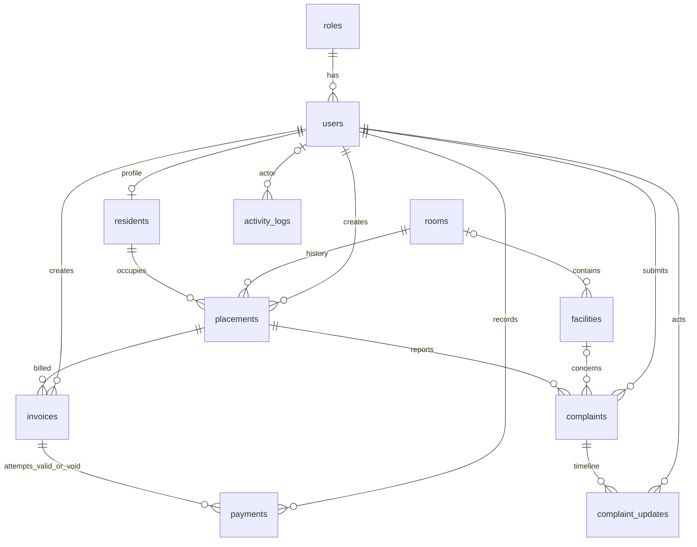

# Arsitektur dan database

## Stack dan struktur

Baseline teknis: Laravel 13, PHP 8.3 atau versi kompatibel yang telah diperiksa, MySQL 8.4, Composer 2, Blade, Bootstrap 5, Chart.js 4, dan Vite bawaan proyek. Laravel 13 memerlukan minimal PHP 8.3 menurut [release notes resmi](https://laravel.com/framework/docs/13.x/releases). Ini target instalasi, bukan klaim bahwa perangkat sudah memilikinya. T01 memeriksa versi PHP, ekstensi, Composer, MySQL, dan Node sesuai dependency Vite sebelum pemasangan. Commit lockfile setelah instalasi berhasil.

Laravel menyediakan [transaksi database](https://laravel.com/framework/docs/13.x/database) dan [policy/gate untuk otorisasi](https://laravel.com/framework/docs/13.x/authorization); gunakan keduanya untuk operasi terkait dan akses resource. Generated column/index MySQL dapat membantu constraint aktif; lihat [dokumentasi MySQL](https://dev.mysql.com/doc/refman/8.4/en/create-table-secondary-indexes.html). Rancangan bisnis di bawah adalah keputusan proyek.

```text
app/Http/Controllers/       controller tipis, respons web
app/Http/Requests/          validasi dan whitelist input
app/Policies/              role dan kepemilikan resource
app/Models/                relasi Eloquent dan cast
app/Services/              PlacementService, BillingService,
                           PaymentService, ComplaintService, AuditService
app/Queries/               DashboardQuery, RevenueReportQuery, BillingReportQuery
resources/views/           layouts, auth, masters, placements, invoices,
                           payments, complaints, reports, audit, resident
resources/css/, js/        Bootstrap, Chart.js, print.css; bundel lokal
database/migrations/       skema, constraint, index
database/seeders/           role, akun demo, data sintetis
tests/Feature/             akses, transaksi, laporan, audit
tests/Unit/                aturan periode/perhitungan murni
docs/plan/                 paket rencana ini
docs/evidence/             hasil tes dan screenshot nyata saat implementasi
```

Alur: browser → session/auth middleware → policy → FormRequest → service/query → MySQL → Blade. Tidak perlu API terpisah, JWT, Redis, Docker, queue, atau scheduler untuk versi pertama. Session berbasis file cukup untuk satu mesin demo. Login memakai fasilitas hashing/session framework, regenerasi session setelah login, invalidasi saat logout, CSRF, throttle login, escaping Blade, query parameter binding, dan whitelist pengurutan. Password, .env, dan data pribadi nyata tidak masuk Git.

## Konvensi

Semua tabel bisnis memakai `id BIGINT UNSIGNED` PK dan `created_at`, `updated_at` timestamp UTC, ditampilkan Asia/Jakarta. Tanggal bisnis bertipe DATE lokal. ID pada FK sama tipenya. `?` berarti nullable; selain itu NOT NULL. Nominal DECIMAL(12,0) dengan pemeriksaan positif; perhitungan PHP menggunakan integer Rupiah dalam rentang aman. String status divalidasi lewat enum aplikasi serta CHECK database. Gunakan InnoDB dan utf8mb4. Tanggal akhir penempatan inklusif.

## Data dictionary

| Tabel | Kolom bisnis, tipe, aturan |
|---|---|
| roles | code VARCHAR(20) UNIQUE: admin/owner/resident; name VARCHAR(50) |
| users | role_id FK roles; name VARCHAR(100); email VARCHAR(191) UNIQUE; password VARCHAR(255) hash; is_active BOOLEAN default true; must_change_password BOOLEAN default false; remember_token VARCHAR(100)? |
| rooms | number VARCHAR(20) UNIQUE; type VARCHAR(50); monthly_rate DECIMAL(12,0)>0; notes TEXT?; archived_at TIMESTAMP? |
| residents | user_id FK users UNIQUE; name VARCHAR(100); phone VARCHAR(20); origin_address VARCHAR(255); archived_at TIMESTAMP? |
| facilities | code VARCHAR(30) UNIQUE; name VARCHAR(100); location_type VARCHAR(20): room/shared; room_id FK rooms?; area_name VARCHAR(100)?; condition VARCHAR(20): good/broken/repairing; notes TEXT?; archived_at TIMESTAMP? |
| placements | resident_id FK residents; room_id FK rooms; started_on DATE; ended_on DATE?; agreed_monthly_rate DECIMAL(12,0)>0; created_by FK users; ended_by FK users?; end_reason VARCHAR(255)?; generated active_room_id dan active_resident_id seperti di bawah |
| invoices | placement_id FK placements; period_month DATE (selalu tanggal 1); due_on DATE; amount DECIMAL(12,0)>0; resident_name_snapshot VARCHAR(100); room_number_snapshot VARCHAR(20); created_by FK users; UNIQUE(placement_id, period_month) |
| payments | invoice_id FK invoices; receipt_number VARCHAR(40) UNIQUE; amount DECIMAL(12,0)>0; paid_on DATE; method VARCHAR(20): cash/transfer; reference VARCHAR(100)?; status VARCHAR(10): valid/void; recorded_by FK users; voided_by FK users?; voided_at TIMESTAMP?; void_reason VARCHAR(255)?; generated valid_invoice_id seperti di bawah |
| complaints | placement_id FK placements; facility_id FK facilities?; subject VARCHAR(120); description TEXT; status VARCHAR(30): open/in_progress/resolved/closed_without_action; submitted_by FK users; closed_at TIMESTAMP? |
| complaint_updates | complaint_id FK complaints; actor_id FK users; from_status VARCHAR(30); to_status VARCHAR(30); note TEXT; occurred_at TIMESTAMP UTC |
| activity_logs | actor_id FK users?; actor_name VARCHAR(100) snapshot; action VARCHAR(50); module VARCHAR(50); entity_type VARCHAR(50)?; entity_id BIGINT?; entity_label VARCHAR(191)?; summary TEXT; changes JSON? (allowlist); occurred_at TIMESTAMP UTC |

Kolom snapshot pada invoice menjaga label historis; relasi tetap dipakai untuk identitas dan otorisasi. Tidak perlu tabel kategori, supplier, atau detail_penjualan. Tarif berjalan ada pada kamar, tarif kontrak pada penempatan, nominal historis pada invoice. Biaya tambahan tidak diimplementasikan versi pertama; Modul 1 menyebutnya hanya jika ada.

`user_id` penghuni wajib: pembuatan profil dan akun dilakukan atomik. Profil penghuni dan nama akun disinkronkan melalui service; identitas invoice lama tidak ikut berubah. Akun hanya boleh memiliki satu role. `created_by` invoice dari pembuatan/sinkronisasi oleh admin, termasuk seeder menggunakan akun admin demo.

## ERD



ERD menampilkan relasi utama. FK ended_by dan voided_by juga menuju users sesuai kamus; tidak ditampilkan terpisah agar diagram terbaca. Snapshot actor_name pada audit tetap tersedia untuk event sistem dengan actor_id null.

## Constraint dan index

- `placements.active_room_id`: generated `CASE WHEN ended_on IS NULL THEN room_id ELSE NULL END`, UNIQUE; active_resident_id dengan pola yang sama. Histori boleh banyak, tetapi satu kamar/penghuni hanya punya satu penempatan aktif. Generated column tidak boleh diisi lewat form.
- `payments.valid_invoice_id`: generated `CASE WHEN status = 'valid' THEN invoice_id ELSE NULL END`, UNIQUE. Pembayaran void tetap tersimpan, sedangkan satu invoice hanya memiliki satu pembayaran sah. MySQL mendukung banyak NULL pada unique index.
- CHECK ended_on null atau >= started_on; field akhir harus lengkap jika diakhiri. CHECK void metadata lengkap jika void, semuanya null jika valid. Nilai pembayaran harus sama invoice melalui service; CHECK lintas tabel tidak digunakan.
- CHECK fasilitas: room berarti room_id terisi dan area_name null; shared berarti room_id null dan area_name terisi. CHECK period_month tanggal 1.
- Index payments(paid_on,status), invoices(period_month,due_on), complaints(status,created_at), activity_logs(occurred_at), activity_logs(module,occurred_at), placements(resident_id,started_on).
- Semua FK histori memakai RESTRICT. Tidak ada cascade delete pembayaran/penempatan/keluhan. Master direferensikan hanya bisa diarsipkan, bukan dihapus. Audit menunjuk entity generik lewat label/snapshot sehingga penghapusan master tanpa referensi tetap bisa ditelusuri.
- Status kamar diturunkan dari penempatan aktif; status invoice diturunkan dari keberadaan pembayaran valid. Jangan menambah kolom status cache yang rawan berbeda dengan transaksi.

## Transaksi dan request bersamaan

Gunakan service sebagai satu pintu semua mutasi, termasuk seeder bila memungkinkan. Urutan lock konsisten saat resource terkait terlibat: resident → room → placement → invoice → payment. Proses yang hanya memerlukan placement/invoice boleh mulai dari sana, tetapi tidak mengambil lock resident/room belakangan. Urutkan ID dalam batch; tangani deadlock dengan retry terbatas dan pesan gagal yang jelas.

Penempatan mengunci resident serta room lalu memeriksa ulang aktif/arsip, membuat placement, invoice pertama, dan audit dalam satu transaksi. Dua request kamar yang sama: satu berhasil, lainnya mendapat konflik yang ramah.

Pembayaran mengunci placement dan invoice, memeriksa tidak ada pembayaran valid, memvalidasi nominal/tanggal, lalu insert payment dan audit dalam satu transaksi. Nomor bukti `PAY-` + ULID dibuat server dan dijaga unique. Pengiriman form ulang tidak membuat pembayaran kedua; arahkan ke pembayaran valid yang sudah ada bila datanya sama, atau tampilkan konflik.

Pembatalan mengunci placement, invoice, payment; hanya valid → void dengan alasan dan audit. Pembayaran ulang menjadi record baru. Gagal menyimpan audit untuk mutasi berarti seluruh mutasi rollback. Query laporan tidak menulis transaksi bisnis; log akses laporan terpisah dan kegagalannya ditampilkan sebagai kegagalan pencatatan, bukan mengarang keberhasilan audit.

## Data uji dan lingkungan

Seeder menyediakan tiga role, satu admin, satu pemilik, minimal empat akun penghuni, enam kamar, fasilitas kamar/bersama, tiga bulan tagihan, pembayaran valid/void, keluhan setiap status. Akun sintetis memakai domain example.test. Database pengujian `sim_kos_test` dipisah dari `sim_kos`; tes constraint/race memakai MySQL, bukan hanya SQLite.

Dump .sql wajib diuji restore ke database baru. Migration/seeder tetap disertakan agar skema dapat ditelusuri. Tidak ada dump nyata yang dibuat pada tahap perencanaan ini.
