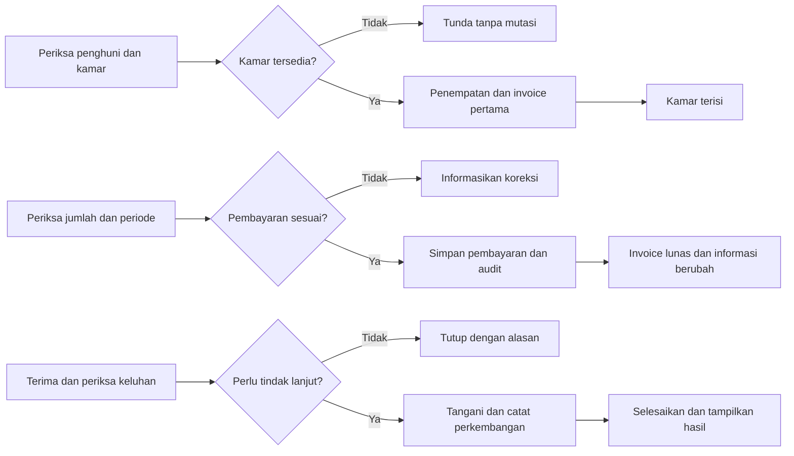

# Proses, aturan bisnis, dan informasi

## Baseline desain

Aturan pada tabel ini adalah asumsi implementasi, bukan kutipan ketentuan dosen. Gunakan secara konsisten untuk versi pertama.

| ID | Keputusan |
|---|---|
| A01 | Satu kamar untuk satu penghuni aktif; tidak ada booking masa depan atau pindah kamar otomatis |
| A02 | Periode adalah bulan kalender; bulan pertama/terakhir dikenai tarif penuh tanpa prorata |
| A03 | Operasi mulai/akhir penempatan melalui UI menggunakan tanggal hari ini Asia/Jakarta; tidak menerima backdate atau tanggal masa depan. Seeder histori merupakan pengecualian khusus data demo |
| A04 | Jatuh tempo tanggal 5 tiap bulan; jika mulai setelah tanggal 5, invoice pertama jatuh tempo pada tanggal mulai |
| A05 | Tarif yang disepakati disalin dari kamar ke penempatan dan tetap selama penempatan. Perubahan tarif kamar hanya berlaku untuk penempatan baru. Tidak ada perubahan harga di tengah kontrak |
| A06 | Tagihan pertama dibuat saat penempatan; admin membuat tagihan bulan berikutnya melalui tombol sinkronisasi. Tanpa scheduler wajib |
| A07 | Pembayaran harus sama persis tagihan, satu periode per transaksi, tunai/transfer dicatat admin. Tidak ada cicilan, kelebihan bayar, pengembalian uang, deposit, atau denda |
| A08 | Penghuni keluar boleh masih memiliki utang; invoice tetap ada dan masih bisa dibayar. Tidak membuat invoice untuk bulan setelah keluar |
| A09 | Pembatalan adalah koreksi pencatatan oleh admin dengan alasan, bukan proses refund uang; bukti lama diberi tanda DIBATALKAN |
| A10 | Pemilik read-only; admin mengelola operasional. Penghuni hanya mengakses kepemilikannya |

Mengakhiri lalu membuat penempatan baru pada bulan yang sama menimbulkan kewajiban penuh untuk masing-masing penempatan. UI harus memperingatkan sebelum menyimpan; perpindahan kamar/prorata berada di luar versi pertama. Ini batas sederhana yang perlu disesuaikan jika tidak cocok dengan praktik kos.

## F01 dan F12 Akun dan portal

Login email/password, throttle awal lima kegagalan per menit per kombinasi email/IP, pesan umum tanpa membocorkan keberadaan akun. Berhasil menuju dashboard sesuai role; logout menggunakan POST dan session invalidation. Pengguna nonaktif ditolak meskipun mempunyai session lama. Ganti password meminta password lama dan konfirmasi baru; minimum 12 karakter sebagai baseline. Tidak ada registrasi publik/reset melalui email.

Pembuatan penghuni oleh admin menghasilkan user role resident dan profil dalam satu transaksi. Password sementara diberikan dalam demo secara lokal dan wajib diganti saat login; tidak masuk audit. Halaman portal memuat kamar aktif atau pesan belum ditempatkan, tagihan sendiri, total belum dibayar sendiri, serta keluhan sendiri. Penghuni yang keluar tetap dapat membaca histori selama akunnya aktif; membuat keluhan baru memerlukan penempatan aktif.

## F02–F04 Master

Field/validasi mengikuti katalog dan kamus data. Search dilakukan di server: kamar berdasarkan nomor/jenis; penghuni nama/telepon/email; fasilitas kode/nama/lokasi. Filter arsip terpisah. Detail menampilkan relasi dan mengapa penghapusan tidak diperbolehkan. Form kamar tidak menyediakan input kosong/terisi. Fasilitas shared boleh dipilih semua penghuni aktif; fasilitas kamar hanya milik kamar penempatannya. Lokasi fasilitas yang pernah direferensikan keluhan tidak boleh dipindahkan; arsipkan lalu buat record baru jika diperlukan.

Tambah/edit/hapus/arsip mencatat ringkasan audit. Hapus penghuni tanpa penempatan/keluhan/transaksi menonaktifkan user dan menghapus profil dalam transaksi; user tetap disimpan untuk identitas audit. Akun tanpa profil tidak memperoleh akses portal data. Perubahan nama penghuni tidak mengubah snapshot invoice historis.

## F05 Penempatan

1. Admin memilih penghuni aktif tanpa penempatan aktif; tampilkan nama, telepon, histori tanggal tinggal.
2. Sistem menampilkan kamar tidak diarsipkan yang tidak mempunyai penempatan aktif, berikut tarif dan fasilitas.
3. Admin meninjau tanggal mulai hari ini, tarif kontrak, nominal invoice pertama dan jatuh tempo, termasuk ketentuan bulan penuh.
4. Saat submit, policy dan validasi dijalankan ulang; lock dan periksa ketersediaan di database. Buat placement, invoice pertama, audit secara atomik.
5. Berhasil menampilkan detail penempatan dan kamar kini terisi. Jika kamar sudah diambil pengguna lain, tidak ada record parsial dan tampilkan pesan memilih kamar lain.

Penghentian: admin membuka penempatan aktif, meninjau tagihan/utang, mengisi alasan, dan mengakhiri hari ini. Dalam transaksi, lengkapi semua invoice yang belum dibuat sampai bulan keluar lalu isi ended_on, ended_by, end_reason dan audit. Kamar menjadi kosong melalui perhitungan relasi. Riwayat, keluhan lama, dan utang tetap ada. Penempatan yang berakhir tidak diedit/dihapus; klik ulang tidak mengubah tanggal atau membuat tagihan ganda.

## F06 Tagihan dan kelengkapan periode

Untuk penempatan P dan bulan M, invoice diperlukan jika rentang tanggal bulan M beririsan dengan rentang penempatan. Rentang akhir penempatan aktif untuk penagihan dibatasi hari ini; M tidak boleh melebihi bulan berjalan. Jumlah per invoice adalah agreed_monthly_rate, bukan harga kamar terkini. Snapshot nama/kamar disalin saat invoice dibuat. Invoice yang sudah dibuat tidak diedit atau dihapus melalui UI.

Tombol “Lengkapi tagihan sampai bulan ini” menampilkan pratinjau jumlah invoice/total baru lalu memanggil service idempoten. Mulai dari bulan started_on sampai minimum(bulan ended_on, bulan berjalan). Setiap placement diproses dalam transaksi tersendiri; unique(placement_id,period_month) memastikan pengulangan aman. Ringkasan menampilkan dibuat/sudah ada/gagal dan audit; gagal sebagian boleh dicoba ulang tanpa menggandakan data.

GET dashboard/laporan tidak diam-diam membuat invoice. Query membandingkan periode yang wajib ada dengan invoice tersedia. Jika ada kekurangan, tampilkan jumlah periode belum dibuat dan peringatan “Data tagihan belum lengkap”; admin mendapat tombol sinkronisasi, pemilik diminta menghubungi admin. KPI jumlah belum bayar diberi label belum lengkap, bukan dianggap total final. Cetak laporan status pembayaran untuk cakupan yang belum lengkap diblokir dengan penjelasan dan langkah memperbaiki. Laporan pendapatan tetap dapat dicetak karena berbasis uang yang sudah tercatat, bukan tagihan yang belum dibuat.

Status turunan: lunas jika ada payment valid, selain itu belum bayar. Terlambat adalah belum bayar dan due_on < hari ini; tepat pada due_on belum terlambat. Nominal tertunggak adalah invoice.amount untuk invoice belum bayar yang jatuh tempo lewat, bukan semua invoice belum bayar.

## F07 Pembayaran dan koreksi

Form memilih invoice belum bayar, bukan mengetik penghuni/kamar bebas. Tampilkan identitas snapshot, periode, tarif, jatuh tempo. Input: paid_on, nominal bulat, metode, referensi opsional. paid_on berada antara max(started_on, awal periode invoice) dan hari ini; pembayaran periode sebelum jatuh tempo diperbolehkan. Form tidak dapat mengubah tarif invoice.

Jumlah tidak sesuai: tampilkan nilai seharusnya, pertahankan input, jangan insert pembayaran, jangan mengubah status atau pendapatan. Ini cabang ketidaksesuaian Modul 2; tidak memerlukan tabel percobaan pembayaran. Jumlah sesuai: transaksi/lock sesuai desain database, nomor PAY-ULID, payment valid, audit; tampilkan bukti. Nilai tidak boleh diterima langsung sebagai status lunas dari browser.

Pembatalan: admin memilih payment valid, memasukkan alasan 10–255 karakter, melihat peringatan dampak. Ubah menjadi void dan isi metadata; invoice kembali belum bayar, total pendapatan sah berkurang, audit menunjukkan pelaku/alasan. Record void tidak dihapus atau kembali valid; pencatatan ulang menghasilkan record/nomor baru. Pembatalan ulang ditolak tanpa mengubah data. Fitur ini untuk koreksi catatan, tanpa integrasi perpindahan uang.

Bukti: nomor, penghuni/kamar snapshot, periode, tanggal bayar, jumlah, metode, pencatat, status. Hanya admin/pemilik atau pemilik invoice boleh melihat/cetak. Bukti void diberi watermark teks DIBATALKAN dan tidak dihitung sebagai pembayaran sah.

## F08 Keluhan

Input: penempatan aktif (ditentukan server untuk penghuni), subjek 5–120, isi 10–3000, fasilitas opsional yang sesuai kamar atau shared. Admin boleh membuat atas nama penghuni aktif; audit submitted_by menunjukkan pelaku sebenarnya. Tidak ada unggah foto/chat.

| Dari | Ke | Syarat dan akibat |
|---|---|---|
| open | in_progress | Admin menuliskan hasil pemeriksaan dan rencana tindakan |
| open | closed_without_action | Alasan wajib, misalnya laporan ganda atau tidak membutuhkan perbaikan; closed_at diisi |
| in_progress | in_progress | Catatan perkembangan wajib |
| in_progress | resolved | Catatan penyelesaian wajib, closed_at diisi |

Status terminal tidak dapat dibuka ulang atau dihapus lewat UI. Penghuni membuat keluhan baru jika masalah berulang. Setiap perubahan menambah complaint_updates dan activity_logs atomik. Menyelesaikan keluhan tidak otomatis mengubah fasilitas menjadi baik karena mungkin ada kerusakan/keluhan lain; admin meninjau lalu memperbarui kondisi fasilitas secara eksplisit.

Ambiguitas sumber: narasi Modul 2 menyebut admin menutup keluhan tanpa tindak lanjut, tetapi kotak diagram terletak pada lane penghuni. Baseline mengikuti narasi: admin memutuskan penutupan, penghuni melihat hasil. Tandai penjelasan ini pada dokumentasi, jangan menyatakan diagram lama telah direvisi/di-ACC.

## Diagram alur pendamping

Diagram berikut membantu implementasi dan bukan pengganti BPMN asli Modul 2.

## F09 Dashboard dan keputusan

Filter bulan/tahun default bulan berjalan untuk pendapatan dan kewajiban. Kartu kamar dan donut selalu berlabel “Saat ini”. Tidak menggunakan cache agregat versi pertama; query ulang setelah redirect transaksi cukup, tanpa websocket.

| Elemen | Rumus/sumber | Keputusan |
|---|---|---|
| Kamar kosong | rooms belum arsip tanpa placement ended_on NULL | Kamar yang dapat ditawarkan |
| Kamar terisi | rooms belum arsip dengan placement ended_on NULL | Kondisi pemakaian kamar |
| Pendapatan bulan terpilih | SUM payments.amount dengan status valid, paid_on dalam bulan | Evaluasi uang masuk |
| Tagihan belum dibayar bulan terpilih | COUNT invoices period_month=M tanpa payment valid; tampilkan nilai total sebagai subteks | Penagihan yang perlu ditindaklanjuti |
| Grafik garis pendapatan | SUM payment valid per bulan paid_on, 6 bulan berakhir pada bulan filter; bulan tanpa data = 0 | Tren pemasukan |
| Grafik donut kamar | Jumlah kosong/terisi saat ini; denominator kamar belum arsip | Ketersediaan saat ini |
| Tabel pembayaran terbaru | 5 payment valid pada bulan filter, sort paid_on DESC lalu id DESC | Pemeriksaan transaksi terkini |

Jika tidak ada kamar, persentase okupansi tampil “Belum ada kamar” bukan membagi nol. Jika data kosong, tabel menampilkan empty state dan angka pendapatan 0. Penghuni memperoleh ringkasan sendiri melalui F12, tidak menampilkan angka keuangan kos.

## F10 Laporan

Laporan pendapatan: rentang tanggal paid_on inklusif, default bulan berjalan. Kolom nomor bukti, tanggal, penghuni/kamar snapshot, periode sewa, metode, pencatat, jumlah. Hanya payment valid; pembatalan dapat diperiksa pada modul pembayaran/audit. Total = SUM seluruh hasil terfilter sebelum pagination. Cari nomor/nama/kamar; sort tanggal, nomor, nama, jumlah dengan whitelist. Label “Pendapatan pembayaran sah berdasarkan tanggal penerimaan”. Pembatalan kemudian mengubah laporan periode lama; ini bukan laporan tutup buku yang dibekukan.

Laporan status pembayaran: rentang bulan period_month, default bulan berjalan, filter status semua/lunas/belum bayar/terlambat. Kolom penghuni, kamar, periode, jatuh tempo, nominal, status terkini, tanggal/nomor pembayaran valid jika ada. Gunakan LEFT JOIN atau relasi agar yang belum membayar tetap masuk. Rekap jumlah/nominal invoice terfilter, nominal lunas, nominal belum bayar, dan nominal terlambat. Cari nama/kamar/nomor bukti; sort periode, nama, jatuh tempo, nominal. Status sesuai waktu laporan dibuka, bukan status historis di tanggal akhir filter.

Kedua laporan: filter valid (awal <= akhir), pencarian, sort stabil dengan ID sekunder, total seluruh hasil, halaman cetak semua hasil terfilter tanpa pagination, keterangan periode/waktu, notifikasi error. GET cetak mengulang policy dan filter whitelist. Untuk demo, batasi rentang laporan maksimum 12 bulan dengan pesan validasi; tidak perlu ekspor Excel. Cetak harus setara tabel dan rekap layar untuk filter yang sama, jika tidak ada mutasi di antaranya.

## F11 Audit

Log master create/update/delete/archive, akun create/active/reset, placement start/end, invoice generate, payment record/void, complaint create/transition, report view/print, login/logout berhasil. `summary` dan entity_label harus dapat dibaca manusia. Changes hanya field yang dibutuhkan, nominal/status boleh, password/token dilarang. Identitas pelaku dan timestamp ditentukan server. Log tidak menyediakan edit/delete pada UI/API. Batas aplikasi ini bukan jaminan log tahan manipulasi oleh administrator database.
